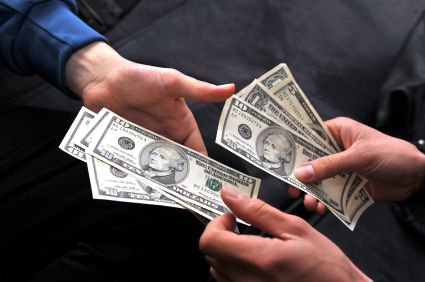

## Money Exchange

### Description

Write a method makeExchange that will determine the minimum number of coins needed to make change for a given amount in American currency.
Coins used will be half-dollars, quarters, dimes, nickels, and pennies, worth 50¢, 25¢, 10¢, 5¢ and 2¢, respectively.
They'll be represented by the strings H, Q, D, N and P.

The argument passed in will be an integer representing the value in cents.
The return value should be an object with the symbols as keys, and the numbers of coins as values.
Coins that are not used should not be included in the object.

### IMPORTANT NOTES

If the argument passed in is 0, then the method should return an empty object.
If the currency can't be exchanged using 50¢, 25¢, 10¢, 5¢ and 2¢ coins please return next object:
```javascript
   { error: "Sorry! We don't have coins for exchange"}
```

### For example:
```javascript
  makeExchange(0)  --> {}
  makeExchange(1)  --> {"P":1}
  makeExchange(43) --> {"Q":1,"D":1,"N":1,"P":3}
  makeExchange(91) --> {"H":1,"Q":1,"D":1,"N":1,"P":1}
```


#### Write your code in `src/index.js`
#### Run test locally `npm test`
